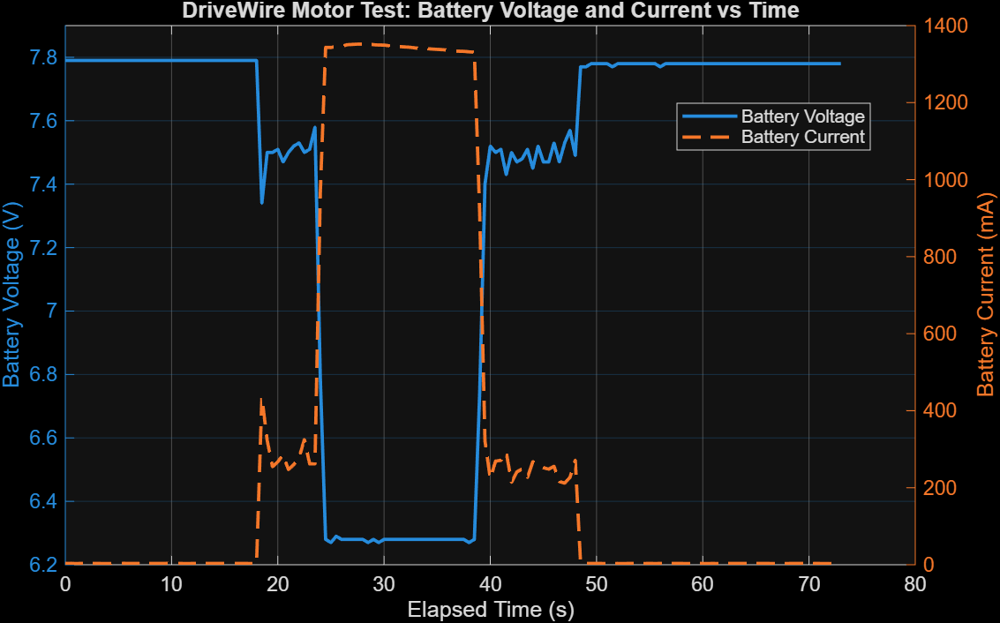
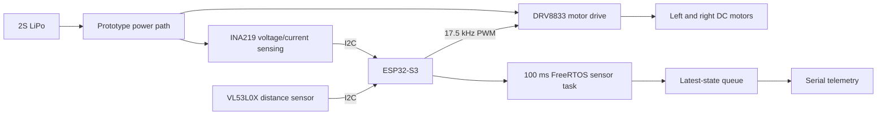
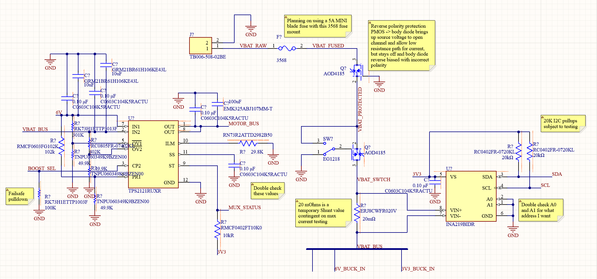

# DriveWire

### A hardware-tested ESP32-S3 rover for embedded control, vehicle telemetry, and power-electronics development

DriveWire is a miniature electric-vehicle test platform built to take an embedded system from breadboard bring-up toward a custom PCB. The current prototype drives two brushed DC motors, measures electrical and distance telemetry, and runs sensor acquisition in a periodic FreeRTOS task. Development is now focused on replacing the lossy prototype power path with a protected 2S LiPo power architecture designed in Altium.

> **Status — September 2026:** the breadboard prototype and core firmware have been exercised on hardware. The custom power schematic is in progress and has not yet been laid out, fabricated, or validated. Telemetry currently runs over serial; Wi-Fi control and a browser dashboard remain planned work.

<p align="center">
  
</p>

## Engineering snapshot

| Area | Implemented and tested | In progress / next |
|---|---|---|
| Embedded firmware | PlatformIO/Arduino firmware, bidirectional motor control, braking/coasting, 17.5 kHz PWM, INA219 and VL53L0X drivers | Control interface, system-level safety logic, encoder feedback |
| Real-time telemetry | 100 ms FreeRTOS sensor task, single-item queue, voltage/current/power/distance state, last-valid-data behavior on failed reads | Recovery after sensor power cycling, telemetry transport over Wi-Fi |
| Electrical | 2S LiPo bench testing, current/voltage capture, stall-current characterization | Altium PCB power path, regulated 6 V and 3.3 V rails, component-value validation |
| Mechanical | Assembled 2WD chassis; three SolidWorks stand iterations; final stand printed in PLA and fit-tested | Dedicated sensor and battery mounting |

## Measured engineering evidence

- **Motor-current characterization:** two repeatable stall captures measured **1.3414 A** and **1.3308 A** using the onboard INA219. The firmware sampling period was reduced to 100 ms and the resulting trace was plotted in MATLAB to inform PCB current ratings.
- **Power-loss isolation:** during stall, INA219 telemetry fell to approximately **6.39 V**, but a DMM at the battery-connected rails measured only **7.78 V to 7.34 V**. This indicates that much of the observed drop is in the breadboard/prototype current path, which is now a design input for the PCB rather than an assumed battery failure.
- **PWM investigation:** a hardware sweep from 1 kHz to 18 kHz tied the audible motor tone to PWM carrier frequency. **17.5 kHz at 8-bit resolution** was selected and verified on both motors at full duty.
- **Sensor robustness:** failed INA219 or ToF reads mark the device offline without overwriting the previous valid telemetry. The VL53L0X produced reliable readings to approximately **1.3 m** under the tested indoor conditions.
- **Mechanical iteration:** the support stand progressed through three SolidWorks revisions before an approximately nine-hour PLA print; the finished part securely suspends the wheels for repeatable bench testing.

<p align="center">
  
</p>

## Current prototype architecture



The firmware keeps commanded motor values, sensor readings, device status, and safety flags in a shared `DriveWireState`. The sensor task refreshes an independent state snapshot and publishes it through a one-element queue with `xQueueOverwrite()`, so the main loop reads a complete latest-value copy rather than partially updated telemetry.

## Custom power-system direction

The first Altium design translates lessons from the prototype into a board-level power path. The present schematic includes a 5 A fuse concept, PMOS reverse-polarity protection, a low-current mechanical switch controlling a power MOSFET, INA219 current sensing, and a TPS2121-based motor-rail concept with regulated 6 V and 3.3 V branches.

These are **design-stage features**, not validated hardware. Shunt value, I2C pull-ups, protection thresholds, regulator implementation, thermal performance, layout, and the complete safety review remain open before fabrication.

<p align="center">
  
</p>

## Repository guide

| Path | Contents |
|---|---|
| [`Firmware/`](Firmware/) | PlatformIO project, motor control, sensor drivers, FreeRTOS task, and hardware test files |
| [`Hardware/`](Hardware/) | Altium project, power-design notes, datasheets, MATLAB test data, and plots |
| [`Mechanical/`](Mechanical/) | Chassis, battery wiring, and SolidWorks/3D-print documentation |
| [`BuildLog.md`](BuildLog.md) | Dated build history with test results, photos, and design decisions |
| [`Debugging.md`](Debugging.md) | Fault isolation, failed hypotheses, and resolved issues |
| [`BOM.md`](BOM.md) | Prototype bill of materials and status |

## Build the firmware

The firmware targets an **ESP32-S3-DevKitC-1** with Arduino through PlatformIO.

```bash
cd Firmware
pio run
pio device monitor -b 115200
```

The upload and monitor ports in [`Firmware/platformio.ini`](Firmware/platformio.ini) are workstation-specific and may need to be changed.

## Project scope

DriveWire is an active engineering prototype, not a finished vehicle. The near-term milestones are to finish and review the power schematic, complete PCB layout, validate the protection and regulator stages, then integrate wireless control and closed-loop motion sensing. The distinction between bench-verified behavior and planned capability is maintained throughout this README and the build log.

---

<strong>Marco Volpini</strong><br>
Electrical Engineering, University of Waterloo
